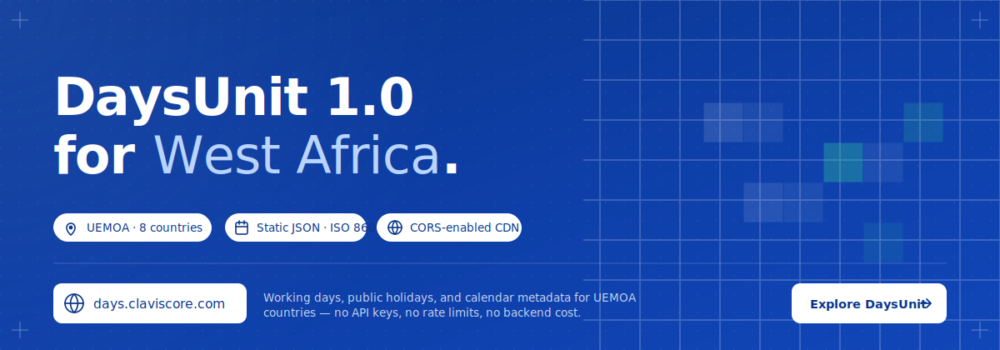

<p align="center">
  
</p>

# DaysUnit

**Zero-infrastructure, open calendar data for West Africa.**

DaysUnit provides per-day working day, public holiday, and calendar metadata for UEMOA member states as static JSON files served over a global CDN — no API keys, no rate limits, no backend costs.

[](https://www.npmjs.com/package/@claviscore/days)
[](LICENSE)
[](https://github.com/Dahkenangnon/days/actions/workflows/validate.yml)

**Primary consumers:** SaaS applications in the UEMOA zone — payroll, accounting (SYSCOHADA), HR, leave management, scheduling.

**Runtime support:** Browser, Node ≥ 18, Deno, Bun — zero bundled calendar data, fetched from CDN at runtime.

> *DaysUnit is a community calendar reference and is not affiliated with any government. For high-stakes use, double-check critical dates against official sources. See [DISCLAIMER.md](DISCLAIMER.md) for the full notes.*

---

## Table of Contents

1. [What is DaysUnit?](#1-what-is-daysunit)
2. [Countries](#2-countries)
3. [Quick Start](#3-quick-start)
4. [CDN Endpoints](#4-cdn-endpoints)
5. [JSON Structure](#5-json-structure)
   - [Single Day](#51-single-day)
   - [Month Aggregate](#52-month-aggregate)
   - [Year Summary](#53-year-summary)
   - [Manifest](#54-manifest)
6. [JavaScript Library — `@claviscore/days`](#6-javascript-library--claviscoreddays)
   - [Installation](#61-installation)
   - [Single day](#62-single-day)
   - [Month](#63-month)
   - [Range](#64-range)
   - [Multi-country batch](#65-multi-country-batch)
   - [Navigation helpers](#66-navigation-helpers)
   - [Configuration](#67-configuration)
   - [Resolver strategy](#68-resolver-strategy)
   - [Error handling](#69-error-handling)
7. [CLI — Offline Cache](#7-cli--offline-cache)
8. [Data Quality & Confidence](#8-data-quality--confidence)
9. [Versioning](#9-versioning)
10. [Repository Structure](#10-repository-structure)
11. [Development Setup](#11-development-setup)
12. [Contributing](#12-contributing)
13. [Maintainer Guide](#13-maintainer-guide)
14. [Security](#14-security)
15. [License](#15-license)
16. [Authorship & Support](#authorship--support)
17. [Disclaimer](DISCLAIMER.md)

---

## 1. What is DaysUnit?

DaysUnit is a zero-infrastructure, open calendar data service for West African countries, with an accompanying runtime-agnostic JavaScript client library.

**Core design principles:**

- Static data only — no server runtime for reads
- ISO 8601 date representation throughout
- Human-reviewable, AI-assisted update mechanism
- Community-maintained via PR model
- Zero bundling of calendar data into the JS package
- Runtime agnostic: browser, Node ≥ 18, Deno, Bun

---

## 2. Countries

**V1 launch — Bénin only.** Calendar data for the remaining UEMOA member states is on the immediate roadmap and will be added under the same schema with no breaking changes.

| Code | Country | Official Language | `countryNames` locales | V1 status |
|------|---------|-------------------|------------------------|-----------|
| `BJ` | Bénin | French | `fr`, `en` | ✅ available |
| `BF` | Burkina Faso | French | `fr`, `en` | 🟡 roadmap |
| `CI` | Côte d'Ivoire | French | `fr`, `en` | 🟡 roadmap |
| `GW` | Guinée-Bissau | Portuguese | `fr`, `en`, `pt` | 🟡 roadmap |
| `ML` | Mali | French | `fr`, `en` | 🟡 roadmap |
| `NE` | Niger | French | `fr`, `en` | 🟡 roadmap |
| `SN` | Sénégal | French | `fr`, `en` | 🟡 roadmap |
| `TG` | Togo | French | `fr`, `en` | 🟡 roadmap |

The `manifest.json` always reflects the actually-deployed coverage, so clients should consult it at runtime rather than hard-coding country lists. As each country is added, it will appear in `manifest.json#/countries` and become fetchable at `/{country}/{year}/...` without any client-library change.

**Future scope:** non-UEMOA ECOWAS states (GH, NG, LR, SL, GM, GN, CV, MR), then CEMAC.

---

## 3. Quick Start

### CDN (no install)

```bash
# Is 2026-01-01 a working day in Bénin?
curl https://days.claviscore.com/bj/2026/01/01.json | jq .isWorkingDay

# Get all January 2026 data for Sénégal
curl https://days.claviscore.com/sn/2026/01.json
```

### JavaScript

```bash
npm install @claviscore/days
```

```ts
import days from '@claviscore/days'

const d = await days('BJ').on('2026-01-15')
console.log(d.isWorking())        // true
console.log(d.isHoliday())        // false

const m = await days('BJ').month(2026, 1)
console.log(m.workingDays())      // 21
```

---

## 4. CDN Endpoints

Base URL: `https://days.claviscore.com`

All paths use lowercase country codes and zero-padded two-digit month/day values.

| Granularity | Pattern | Example |
|-------------|---------|---------|
| Single day | `/{country}/{year}/{month}/{day}.json` | `/bj/2026/01/01.json` |
| Month aggregate | `/{country}/{year}/{month}.json` | `/bj/2026/01.json` |
| Year summary | `/{country}/{year}.json` | `/bj/2026.json` |
| Manifest | `/manifest.json` | `/manifest.json` |
| JSON Schemas | `/schema/{type}.schema.json` | `/schema/day.schema.json` |

**Rules:**
- Country codes are lowercase ISO 3166-1 alpha-2 (`bj`, `ci`, `sn`, …)
- Month and day values are always zero-padded two-digit integers (`01`–`12`, `01`–`31`)
- Year values are four-digit integers

**Recommendation:** Fetch **month aggregates** for most use cases. A single month file contains all flag fields for every day in the month, minimising HTTP requests.

All responses include `Access-Control-Allow-Origin: *` — safe to call directly from browsers.

---

## 5. JSON Structure

### 5.1 Single Day

`GET /bj/2026/01/01.json`

```json
{
  "schemaVersion": "1.0",
  "date": "2026-01-01",
  "country": "BJ",
  "countryName": "Bénin",
  "countryNames": { "fr": "Bénin", "en": "Benin" },
  "timezone": "Africa/Porto-Novo",
  "dayOfWeek": 4,
  "isWeekend": false,
  "isPublicHoliday": true,
  "isWorkingDay": false,
  "isFirstWorkingDayOfMonth": false,
  "isLastWorkingDayOfMonth": false,
  "isRamadanPeriod": false,
  "holidayName": { "fr": "Jour de l'An", "en": "New Year's Day" },
  "holidayType": "national",
  "religiousAffiliation": null,
  "observedDate": null,
  "legalBasis": "Loi n° 98-004 du 27 janvier 1998",
  "source": "https://jo.gouv.bj/...",
  "verifiedAt": "2025-11-01",
  "confidence": "confirmed",
  "weekNumber": 1,
  "quarter": 1,
  "workingDayOfMonth": null,
  "workingDayOfYear": null
}
```

**Field reference:**

| Field | Type | Description |
|-------|------|-------------|
| `schemaVersion` | `string` | `MAJOR.MINOR` — schema version in use |
| `date` | `string` (ISO 8601) | The calendar date |
| `country` | `string` | ISO 3166-1 alpha-2 uppercase |
| `countryName` | `string` | Primary name in French |
| `countryNames` | `object` | Localized names — `fr` and `en` always present; `pt` present for `GW` |
| `timezone` | `string` | IANA timezone identifier |
| `dayOfWeek` | `integer` | ISO: Monday=1 … Sunday=7 |
| `isWeekend` | `boolean` | Saturday or Sunday |
| `isPublicHoliday` | `boolean` | Legal public holiday |
| `isWorkingDay` | `boolean` | Not weekend and not public holiday |
| `isFirstWorkingDayOfMonth` | `boolean` | First working day of the calendar month |
| `isLastWorkingDayOfMonth` | `boolean` | Last working day of the calendar month — key for payroll / SYSCOHADA |
| `isRamadanPeriod` | `boolean` | Within the Ramadan month (relevant for ML, NE, SN, BF) |
| `holidayName` | `object\|null` | i18n map of the holiday name; null on non-holidays |
| `holidayType` | `enum\|null` | `national` \| `religious` \| `observance` \| `bridge` \| `school` |
| `religiousAffiliation` | `enum\|null` | `christian` \| `islamic` \| `secular` \| `animist` |
| `observedDate` | `string\|null` | Observed rest date when holiday falls on a weekend |
| `legalBasis` | `string\|null` | Journal Officiel decree or law reference |
| `source` | `string\|null` | URL of the authoritative source document |
| `verifiedAt` | `string` (ISO 8601 date) | Date data was last reviewed |
| `confidence` | `enum` | `confirmed` \| `tentative` \| `ai-generated` |
| `weekNumber` | `integer` | ISO week number (1–53) |
| `quarter` | `integer` | Calendar quarter (1–4) |
| `workingDayOfMonth` | `integer\|null` | Ordinal among working days in the month |
| `workingDayOfYear` | `integer\|null` | Ordinal among working days in the year |

---

### 5.2 Month Aggregate

`GET /bj/2026/01.json`

```json
{
  "schemaVersion": "1.0",
  "country": "BJ",
  "countryName": "Bénin",
  "countryNames": { "fr": "Bénin", "en": "Benin" },
  "timezone": "Africa/Porto-Novo",
  "year": 2026,
  "month": 1,
  "workingDaysCount": 21,
  "weekendDaysCount": 8,
  "publicHolidaysCount": 1,
  "days": [
    {
      "date": "2026-01-01",
      "dayOfWeek": 4,
      "isWeekend": false,
      "isPublicHoliday": true,
      "isWorkingDay": false,
      "isFirstWorkingDayOfMonth": false,
      "isLastWorkingDayOfMonth": false,
      "isRamadanPeriod": false,
      "confidence": "confirmed"
    }
  ]
}
```

The `days` array contains exactly one entry per calendar day in the month, in ascending order.

---

### 5.3 Year Summary

`GET /bj/2026.json`

Same structure as the month aggregate but covers the full year (`days` has 365 or 366 entries). Verbose text fields (`holidayName`, `legalBasis`, `source`, etc.) are omitted to minimise file size — use individual day files when you need them.

---

### 5.4 Manifest

`GET /manifest.json`

```json
{
  "schemaVersion": "1.0",
  "lastUpdated": "2026-03-15",
  "countries": ["BJ", "BF", "CI", "GW", "ML", "NE", "SN", "TG"],
  "yearsAvailable": [2024, 2025, 2026, 2027],
  "baseUrl": "https://days.claviscore.com",
  "endpoints": {
    "day":      "/{country}/{year}/{month}/{day}.json",
    "month":    "/{country}/{year}/{month}.json",
    "year":     "/{country}/{year}.json",
    "manifest": "/manifest.json"
  },
  "schemaUrls": {
    "day":      "/schema/day.schema.json",
    "month":    "/schema/month.schema.json",
    "year":     "/schema/year.schema.json",
    "manifest": "/schema/manifest.schema.json"
  }
}
```

---

## 6. JavaScript Library — `@claviscore/days`

Runtime-agnostic TypeScript client. Works in browser, Node ≥ 18, Deno, and Bun. Ships zero calendar data — data is fetched from the CDN at runtime or from a local offline cache.

### 6.1 Installation

```bash
npm install @claviscore/days
# or
pnpm add @claviscore/days
# or
yarn add @claviscore/days
```

### 6.2 Single day

```ts
import days from '@claviscore/days'

const d = await days('BJ').on('2026-01-01')

d.isWorking()              // → boolean
d.isHoliday()              // → boolean
d.isWeekend()              // → boolean
d.dayOfWeek()              // → 1–7 (ISO: Monday=1, Sunday=7)
d.isFirstWorkingDay()      // → boolean
d.isLastWorkingDay()       // → boolean
d.isRamadanPeriod()        // → boolean
d.religiousAffiliation()   // → 'christian' | 'islamic' | 'secular' | 'animist' | null
d.name()                   // → { fr: string; en: string; [locale: string]: string } | null
d.countryName()            // → string (always French)
d.countryNames()           // → { fr: string; en: string; pt?: string; [locale: string]: string }
d.timezone()               // → string (IANA timezone identifier)
d.confidence()             // → 'confirmed' | 'tentative' | 'ai-generated'
d.raw()                    // → DayRecord (full schema object)
```

### 6.3 Month

```ts
const m = await days('BJ').month(2026, 1)

m.workingDays()           // → number
m.holidays()              // → MonthDayEntry[]
m.each(fn)                // → void — iterates all days
m.find('2026-01-15')      // → MonthDayEntry | undefined
m.raw()                   // → MonthRecord
```

### 6.4 Range

```ts
const r = await days('BJ').range('2026-01-01', '2026-03-31')

r.workingDays()           // → number
r.holidays()              // → MonthDayEntry[]
r.each(fn)                // → void — iterates all days in range
```

Fetches the minimum set of month aggregates covering the range — not individual day files.

### 6.5 Multi-country batch

```ts
const batch = await days(['BJ', 'CI', 'SN']).on('2026-01-01')
// → Record<'BJ' | 'CI' | 'SN', DayResult>

batch.BJ.isWorking()      // → boolean
batch.CI.isHoliday()      // → boolean
```

Fetches are issued in parallel (`Promise.all`).

### 6.6 Navigation helpers

```ts
await days('BJ').nextWorkingDay('2026-01-01')
// → '2026-01-02'  (string, ISO 8601)

await days('BJ').prevWorkingDay('2026-01-01')
// → '2025-12-31'

await days('BJ').workingDaysInRange('2026-01-01', '2026-01-31')
// → 21  (number)
```

Navigation helpers fetch month aggregates, not individual day files.

### 6.7 Configuration

```ts
import days, { configure } from '@claviscore/days'

configure({
  baseUrl: 'https://days.claviscore.com',  // override CDN base URL (e.g. for self-hosting)
  cacheDir: './.days',                      // local cache path (Node/Deno/Bun only)
  fallbackToCdn: true,                      // fall back to CDN on local cache miss
  timeoutMs: 10_000                         // per-request timeout (0 disables)
})
```

Call `configure()` once at application startup before any `days()` calls.

### 6.8 Resolver strategy

The resolver always works at **month-aggregate granularity**. Single-day lookups fetch the parent month aggregate and extract the target day, minimising HTTP requests and enabling efficient HTTP caching.

```
Server runtimes (Node ≥ 18, Deno, Bun):
  1. Local cache  →  {cacheDir}/{country}/{year}/{month}.json
  2. CDN fetch    →  {baseUrl}/{country}/{year}/{month}.json

Browser:
  1. CDN fetch only (no filesystem access)
```

### 6.9 Error handling

All I/O errors throw a `DaysError` instance with a `code` string property:

```ts
import { DaysError } from '@claviscore/days'

try {
  const d = await days('BJ').on('2026-01-01')
} catch (err) {
  if (err instanceof DaysError) {
    console.error(err.code, err.message)
  }
}
```

---

## 7. CLI — Offline Cache

The `@claviscore/days` package ships a `days` binary for pre-downloading data into a local cache. This enables zero-latency lookups in server-side applications and works fully offline.

```bash
# Download BJ calendar for 2026
npx days pull --country BJ --year 2026

# Multiple countries and years (comma-separated)
npx days pull --country BJ,CI,SN --year 2026,2027

# All UEMOA countries (convenience alias)
npx days pull --uemoa --year 2026

# Override output path (default: .days/ at cwd)
npx days pull --country BJ --year 2026 --out ./src/static/days

# Show locally cached data
npx days cache list

# Clear entire cache
npx days cache clear

# Clear one country+year from cache
npx days cache clear --country BJ --year 2026
```

**Behaviour:**
- For each `(country, year)` pair, the CLI fetches all 12 month-aggregate files in parallel.
- If a file already exists locally and the CDN reports no change, the download is skipped.
- The CLI exits with code `1` on any fetch error and prints the failed URL.

**Cache layout:**

```
.days/
├── bj/
│   └── 2026/
│       ├── 01.json
│       └── ...
└── ci/
    └── 2026/
        └── ...
```

Add `.days/` to your `.gitignore`.

---

## 8. Data Quality & Confidence


Every record carries a `confidence` field:

| Value | Meaning |
|-------|---------|
| `confirmed` | Verified by a human maintainer against an official source document |
| `tentative` | Plausible but not fully verified (e.g. variable Islamic dates) |
| `ai-generated` | Produced by an AI agent; pending human review — do not rely on this in production |

The `source` field on every day record points to the authoritative legal document (Journal Officiel, government decree) when available.

Data is kept current through three mechanisms:

1. **Annual pre-generation** — maintainers generate the following year's data each November from official sources (see [Maintainer Guide](#13-maintainer-guide)).
2. **Exception monitoring (forthcoming)** — a daily automated monitor will watch official gazettes and open AI-proposed PRs (labelled `ai-proposed`) when changes are detected. All such PRs will require human approval before merge. Until this lands, exceptions are handled via mechanism (3) below.
3. **Community corrections** — anyone can open a PR to correct a data error (see [CONTRIBUTING.md](CONTRIBUTING.md)).

---

## 9. Versioning

### Data schema

`schemaVersion` follows `MAJOR.MINOR`:
- **MINOR** — new optional field added; all existing files remain valid
- **MAJOR** — breaking change; old schema version kept at a new path for ≥ 12 months

### npm package

`@claviscore/days` follows [Semantic Versioning 2.0.0](https://semver.org/):
- **PATCH** — bug fixes
- **MINOR** — new API methods or config options (backward compatible)
- **MAJOR** — breaking API surface changes

### Git tags

| Type | Pattern | Example |
|------|---------|---------|
| Data release | `data/v{year}-{sequence}` | `data/v2026-01` |
| Package release | `js/v{semver}` | `js/v1.2.0` |

---

## 10. Repository Structure

```
days/
├── packages/
│   ├── data/              ← Static JSON calendar files (CDN root)
│   │   ├── _headers       ← CORS + Cache-Control rules
│   │   ├── manifest.json
│   │   ├── schema/        ← JSON Schema Draft 2020-12 definitions
│   │   └── {country}/{year}/{month}/{day}.json
│   └── js/                ← @claviscore/days npm package
│       └── src/
│           ├── index.ts   ← public API entry
│           ├── builder.ts ← fluent chain root
│           ├── resolver.ts← local cache → CDN fallback
│           ├── fetcher.ts ← runtime-agnostic fetch
│           ├── types.ts   ← all exported types
│           ├── errors.ts  ← DaysError class
│           └── cli.ts     ← days binary
└── tools/
    ├── generate-aggregates.ts  ← day files → month + year aggregates
    └── seed-country.ts         ← seeds day files from sources.json
```

---

## 11. Development Setup

### Prerequisites

- [Node.js](https://nodejs.org/) ≥ 18
- [pnpm](https://pnpm.io/) ≥ 9

```bash
npm install -g pnpm
```

### Install

```bash
git clone https://github.com/Dahkenangnon/days.git
cd days
pnpm install
```

### Workspace scripts

```bash
# Validate all data files against JSON Schema
pnpm validate

# Build the @claviscore/days npm package
pnpm build:js

# Type-check the JS library
pnpm --filter @claviscore/days run typecheck

# Regenerate month + year aggregates for a given year
pnpm generate -- --year 2026

# Regenerate for a specific country only
pnpm generate -- --year 2026 --country BJ

# Dry run (validate without writing)
pnpm generate -- --year 2026 --dry-run
```

### Running schema validation locally

```bash
pnpm validate
```

This runs `ajv-cli` against all day, month, year, and manifest files under `packages/data/`.

---

## 12. Contributing

We welcome data corrections, new country data, and library improvements. Please read [CONTRIBUTING.md](CONTRIBUTING.md) before opening a PR.

**Quick links:**
- [Report a data error](https://github.com/Dahkenangnon/days/issues/new?template=data-error.yml)
- [Request a feature](https://github.com/Dahkenangnon/days/issues/new?template=feature-request.yml)
- [Report a library bug](https://github.com/Dahkenangnon/days/issues/new?template=bug-report.yml)
- [Security Policy](SECURITY.md)

### Summary of contribution types

| Type | Branch pattern | Example |
|------|---------------|---------|
| Data correction | `fix/data-{country}-{date}` | `fix/data-bj-2026-03-20` |
| New country data | `data/add-{country}-{year}` | `data/add-sn-2027` |
| Annual pre-gen | `data/pre-gen-{year}` | `data/pre-gen-2027` |
| Library feature | `feat/days-{description}` | `feat/days-batch-range` |
| Library fix | `fix/days-{description}` | `fix/days-resolver-cache` |

All PRs touching `packages/data/` must pass the `validate.yml` CI schema check.

---

## 13. Maintainer Guide

This section covers tasks performed by project maintainers.

### Annual pre-generation (each November)

Run each November for the following calendar year. Target: merge before December 1.

```bash
# 1. Create a branch
git checkout -b data/pre-gen-2027

# 2. Update tools/sources.json with the new year's holiday definitions

# 3. Seed day files for each country
tsx tools/seed-country.ts --country BJ --year 2027
# ... repeat for all 8 countries

# 4. Generate month + year aggregates
pnpm generate -- --year 2027

# 5. Validate
pnpm validate

# 6. Update packages/data/manifest.json to add 2027 to yearsAvailable

# 7. Open a PR with label pre-generation
# At least one other maintainer must review the data against sources.json

# 8. Tag after merge
git tag data/v2027-01
git push --tags
```

### Publishing a package release

```bash
# Bump version in packages/js/package.json first
git tag js/v1.2.0
git push --tags
# → triggers release-pkg.yml: GitHub Release + npm publish
```

The `release-pkg.yml` workflow requires the `NPM_TOKEN` repository secret to be set.

### Reviewing AI-proposed PRs (label: `ai-proposed`)

1. Check the PR body for the raw source excerpt and the monitor's reasoning.
2. Verify the affected dates against the linked source URL.
3. Change `confidence` from `ai-generated` to `confirmed` or `tentative` on each modified record.
4. Approve and merge.

> **Never auto-merge AI-proposed PRs.** Human approval is always required.

---

## 14. Security

See [SECURITY.md](SECURITY.md) for the full security policy, including how to report data integrity issues that could affect payroll or SYSCOHADA journal closings.

---

## 15. License

DaysUnit uses a dual licence so that code and data stay legally distinct:

| Asset | License |
|---|---|
| Source code (`packages/js/`, `tools/`) | [MIT](LICENSE) |
| Calendar data (`packages/data/`) | [CC BY 4.0](packages/data/LICENSE) |

If you redistribute the calendar data, please attribute it as required by CC BY 4.0 — see [`packages/data/LICENSE`](packages/data/LICENSE) for the suggested attribution string.

See [DISCLAIMER.md](DISCLAIMER.md) for the standard "as-is, no warranty" notice that applies to both.

---

## Authorship & Support

Built and maintained by [Justin Dah-kenangnon](https://github.com/Dahkenangnon) — <dah.kenangnon@gmail.com>.

Supported by [ClavisCore LLC](https://claviscore.com), which hosts the CDN at `days.claviscore.com`.

